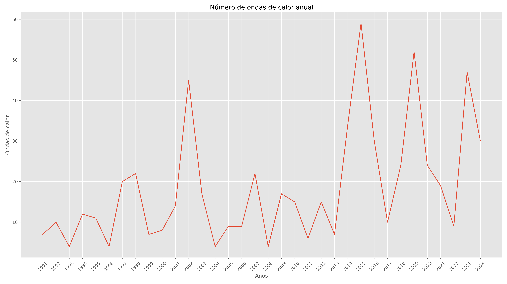
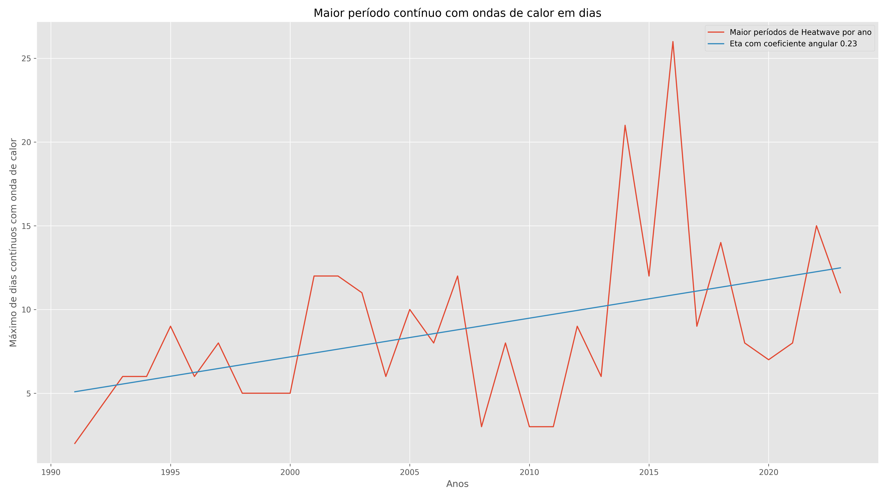
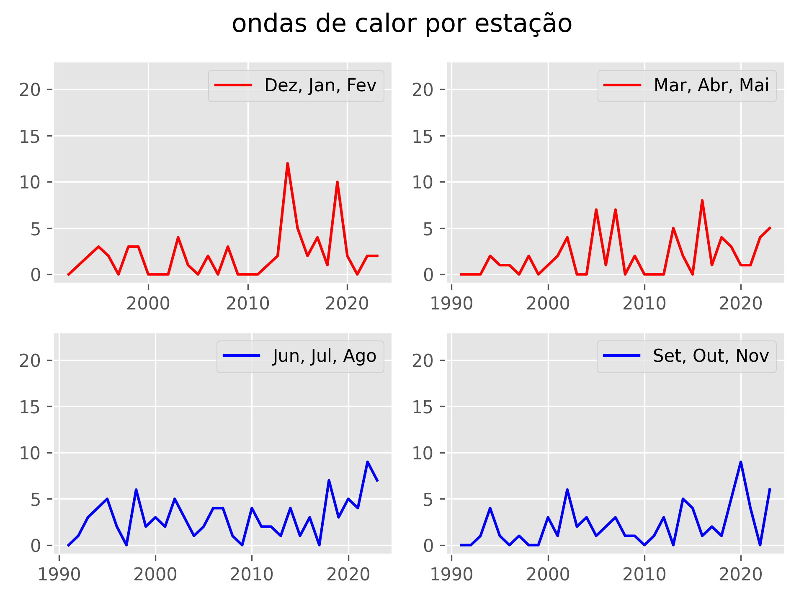
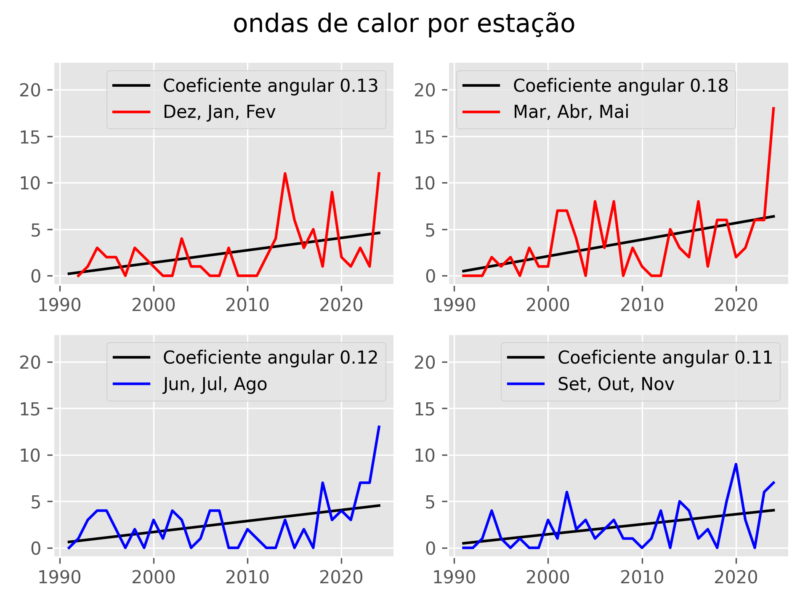
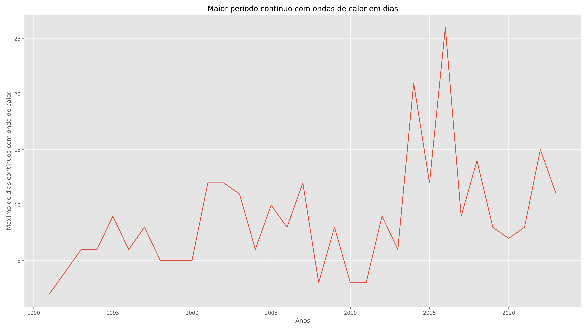
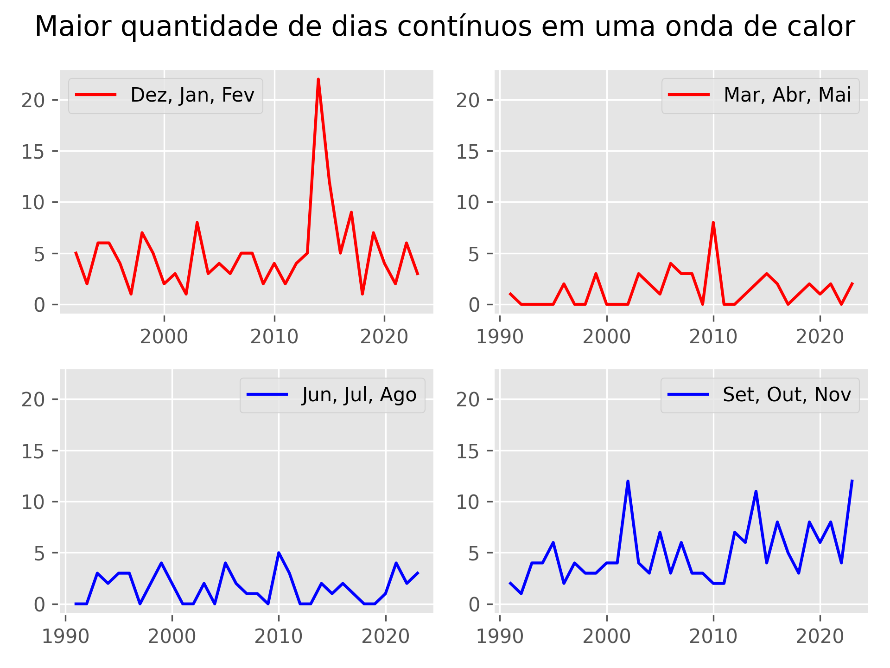
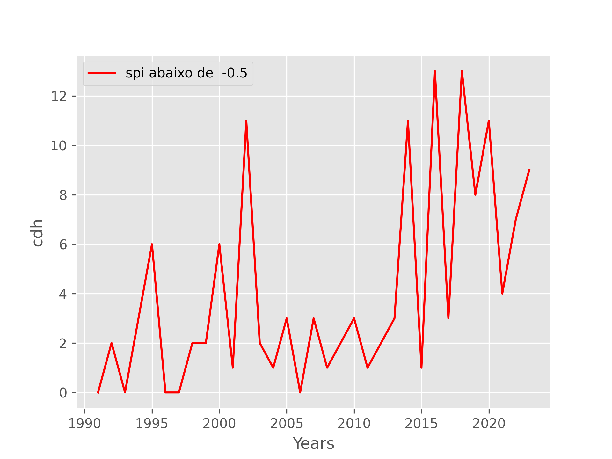

# Description of code and your functions

The code may priorize make all necessary calculations in *Python* and *CDO*.
All conected by *BASH* and running in Linux systems. 

## To run the code

	./extremos.sh tmax.nc 1990 90 15 pr.nc

The paramns are:

1) it's the daily maximum temperature netcdf file complete, like (1961-2024)
2) it's the year that start the calculation of index
3) it's the percentil that is used in temperature relative calculations
4) it's number of days that are used like window calculation
5) it's the daily precipitation netcdf file, like (1961-2024)

**The images are saved ar directory "imagens" and the data are saved in directory "dados"**

## ./dados
1. <b> Heatwave.csv </b> is the file with annual heatwaves
2. <b> Heatwaves_days.csv </b> is the file with the maximum continum period of heatwave 
3. <b> Heatwaves_complete.csv </b> is the file that say the dayly period of heatwaves. 0 don't have heatwave, 1 have heatwaves next 3 days
4. <b> season.csv </b> if the file with daily heatwave, but separete by season, colum:1 of Nov-Fev, colum:2 of Mar-Mai, colum:3 of Jun-Ago, colum:4 of Set-Nov
5. <b> season_heatwave.csv </b> is the heatwaves separate by season, colum:1 of Nov-Fev, colum:2 of Mar-Mai, colum:3 of Jun-Ago, colum:4 of Set-Nov
6. <b> kendall.csv </b> is the file with heatwaves values for  mann-Kendall test and linear regression

## ./intern
1. <a href="./intern/spi.py"> spy.py</a> use the precipitaion to calculate the spi index

2. <a href="./intern/HeatWave.py">HeatWave.py</a>  calculate the heatwave by year, season and extention
3. <a href="./intern/geirinhas.py">geirinhas.py</a>  calculate the index based at gueirinhas metodology
4. <a href="./intern/linear.py">linear.py</a> calculate the linear regresion and Mann-Kendall test for heatwaves
5. <a href="./intern/linear_season.py">linear_season.py</a> calculate linear regression and Mann-Kendall test  for season heatwaves and continum heatwaves
6. <a href="./intern/plot_spi.py">plot_spi.py</a> create the graph of spi in html 

## Reference
Geirinhas, João & Russo, Ana & Libonati, Renata & Sousa, Pedro & Miralles, Diego & Trigo, Ricardo. (2021). <a href="https://iopscience.iop.org/article/10.1088/1748-9326/abe0eb">Recent increasing frequency of compound summer drought and heatwaves in Southeast Brazil. Environmental Research Letters</a>. 16. 10.1088/1748-9326/abe0eb. 

<a hef="https://www.undrr.org/understanding-disaster-risk/terminology/hips/mh0047#:~:text=It%20defines%20heatwaves%20as%2C%20%E2%80%9Cperiods,WMO%20and%20WHO%2C%202015)."> United Nations Office for Disaster Rist Reduction</a>, Accessed 3 mar 2024

Xavier, A. C., Scanlon, B. R., King, C. W., & Alves, A. I. (2022). <a href="https://github.com/AlexandreCandidoXavier/BR-DWGD">New improved Brazilian daily weather gridded data (1961–2020) </a>. International Journal of Climatology, 42(16), 8390– 8404. https://doi.org/10.1002/joc.7731

## Example
The Heatwaves graph is:

When we consider the contius períod with heatwaves

Separete by season:

When we consider the CDH index:

