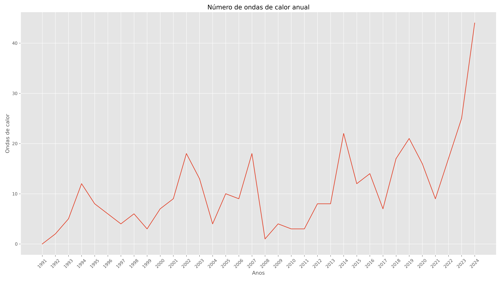
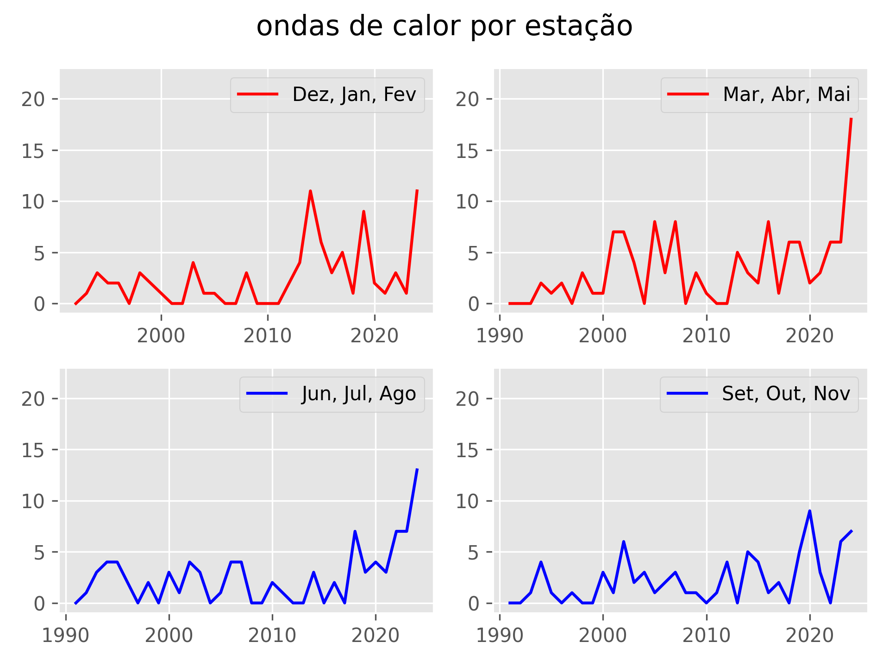
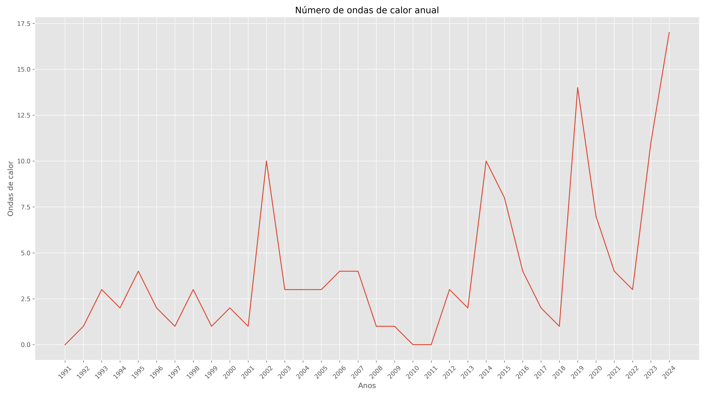
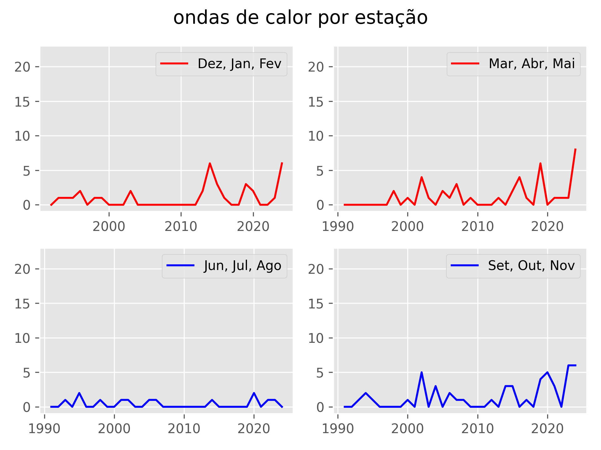
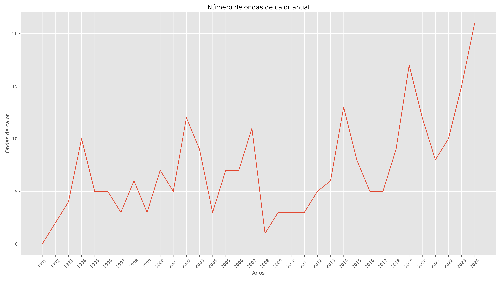
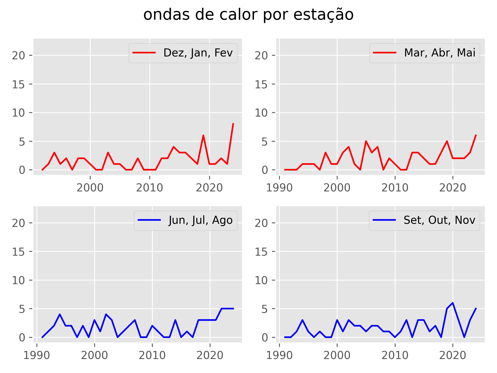
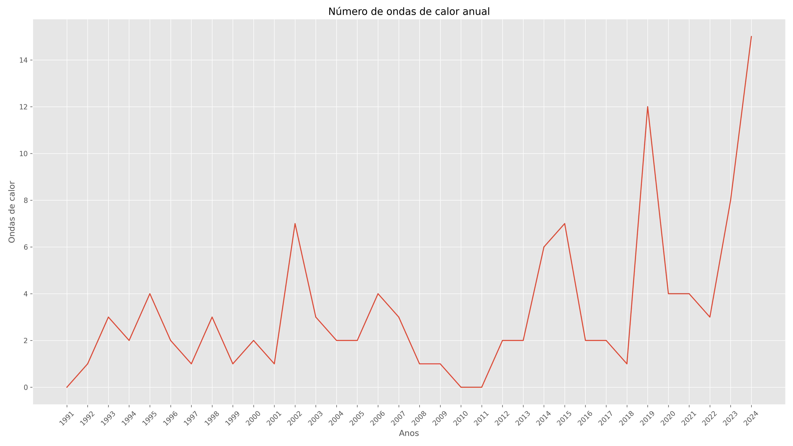
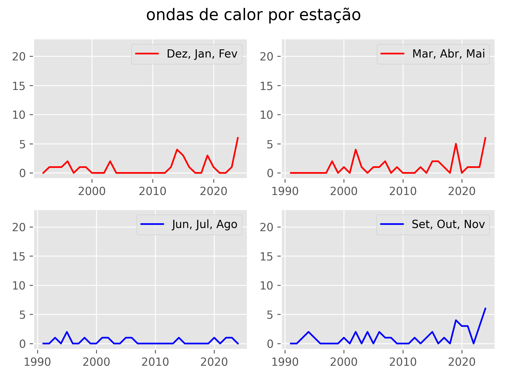

# Description of code and your functions

The code may priorize make all necessary calculations in *Python* and *CDO*.
For python you will need pandas, numpy, scipy, xarray and alive-progress
All conected by *BASH* and running in Linux systems. 

## To run the code

	./extremos.sh netcdf/tmax.nc 1990 90 15 [netcdf/pr.nc] [netcdf/tmin.nc]

the params inside [] are option that need only if the calculus need
The paramns are:

1) it's the daily maximum temperature netcdf file complete, like (1961-2024)
2) it's the year that start the calculation of index
3) it's the percentil that is used in temperature relative calculations
4) it's number of days that are used like window calculation
5) it's the daily precipitation netcdf file, like (1961-2024)
6) it's the daily minimum temperature netcdf file complete, like (1961-2024)

**The images are saved ar directory "imagens" and the data are saved in directory "dados"**

## ./dados
1. <b> Heatwave.csv </b> is the file with annual heatwaves
2. <b> Heatwaves_days.csv </b> is the file with the maximum continum period of heatwave 
3. <b> Heatwaves_complete.csv </b> is the file that say the dayly period of heatwaves. 0 don't have heatwave, 1 have heatwaves next 3 days
4. <b> season.csv </b> if the file with daily heatwave, but separete by season, colum:1 of Nov-Fev, colum:2 of Mar-Mai, colum:3 of Jun-Ago, colum:4 of Set-Nov
5. <b> season_heatwave.csv </b> is the heatwaves separate by season, colum:1 of Nov-Fev, colum:2 of Mar-Mai, colum:3 of Jun-Ago, colum:4 of Set-Nov
6. <b> kendall.csv </b> is the file with heatwaves values for  mann-Kendall test and linear regression
7. <b> input.csv </b> is the file with all data from campinas in txt format the facilite the update

## ./netcdf
#1. <b> tmax.nc </b> is the tmax temperatura for one latitude and longitude
#1. <b> tmin.nc </b> is the tmin temperatura for one latitude and longitude
#1. <b> pr.nc </b> is the precipitation for one latitude and longitude

## ./intern
1. <a href="./intern/spi.py"> spy.py</a> use the precipitaion to calculate the spi index

2. <a href="./intern/HeatWave.py">HeatWave.py</a>  calculate the heatwave by year, season and extention considering World Meteorogical Organization definition of Heatwave
2. <a href="./intern/tmantmin_heatwave.py">tmaxtmin_heatwave.py</a>  calculate the heatwave by year, season and extention considering World Meteorogical Organization definition of Heatwave using min temperature
3. <a href="./intern/geirinhas.py">geirinhas.py</a>  calculate the index based at gueirinhas metodology
4. <a href="./intern/linear.py">linear.py</a> calculate the linear regresion and Mann-Kendall test for heatwaves
5. <a href="./intern/linear_season.py">linear_season.py</a> calculate linear regression and Mann-Kendall test  for season heatwaves and continum heatwaves
6. <a href="./intern/plot_spi.py">plot_spi.py</a> create the graph of spi in html 
6. <a href="./intern/plot_linear_tmaxtmin_heatwave.py">plot_linear_tmaxtmin_heatwave.py</a> create the graph of heatwave of tmaxtmin heatwaves
6. <a href="./intern/anomaly.py">anomaly.py</a> create the graph of temperature anomaly of each heatwave
6. <a href="./intern/cumulative_heat.py">cumulative_heat.py</a> calculate the anomaly of temperature for each heatwave
7. <a href="./intern/txttonetcdf.py"> txttonetcdf.py </a> open the file in ./dados/input.csv, that can be updated with excel and after to convert to netcdf
8. <a href="./intern/heatwave3ormore.py"> heatwave3ormore </a> open the file in ./intern/heatwave3ormore.py, that create the heatwave files considering heatwaves when has 3 hotdays using maximum temperature

## Reference
Geirinhas, João & Russo, Ana & Libonati, Renata & Sousa, Pedro & Miralles, Diego & Trigo, Ricardo. (2021). <a href="https://iopscience.iop.org/article/10.1088/1748-9326/abe0eb">Recent increasing frequency of compound summer drought and heatwaves in Southeast Brazil. Environmental Research Letters</a>. 16. 10.1088/1748-9326/abe0eb. 

<a hef="https://www.undrr.org/understanding-disaster-risk/terminology/hips/mh0047#:~:text=It%20defines%20heatwaves%20as%2C%20%E2%80%9Cperiods,WMO%20and%20WHO%2C%202015)."> United Nations Office for Disaster Rist Reduction</a>, Accessed 3 mar 2024

Xavier, A. C., Scanlon, B. R., King, C. W., & Alves, A. I. (2022). <a href="https://github.com/AlexandreCandidoXavier/BR-DWGD">New improved Brazilian daily weather gridded data (1961–2020) </a>. International Journal of Climatology, 42(16), 8390– 8404. https://doi.org/10.1002/joc.7731

Intense Heat Wave

John R. Nairn 1,* and Robert J. B. Fawcett. (2013). <a href="https://www.researchgate.net/publication/270292252_The_Excess_Heat_Factor_A_Metric_for_Heatwave_Intensity_and_Its_Use_in_Classifying_Heatwave_Severity">The Excess Heat Factor: A Metric for Heatwave Intensity and Its Use in Classifying Heatwave Severity </a>. International Journal of Environmental Research and Public Health (IJERPH)

## Example
The Heatwaves graph is:

| Definitions  | Heatwaves by year| Heatwaves by season|
| ------------- | ------------- |------------- |
| 3 days with hot days using tmax  |  |  |
| 3 days with hot days using tmax and tmin |   |   |
| 3 days or more with hot days using tmax |   |   |
| 3 days or more with hot days using tmax and tmin|   |   |

